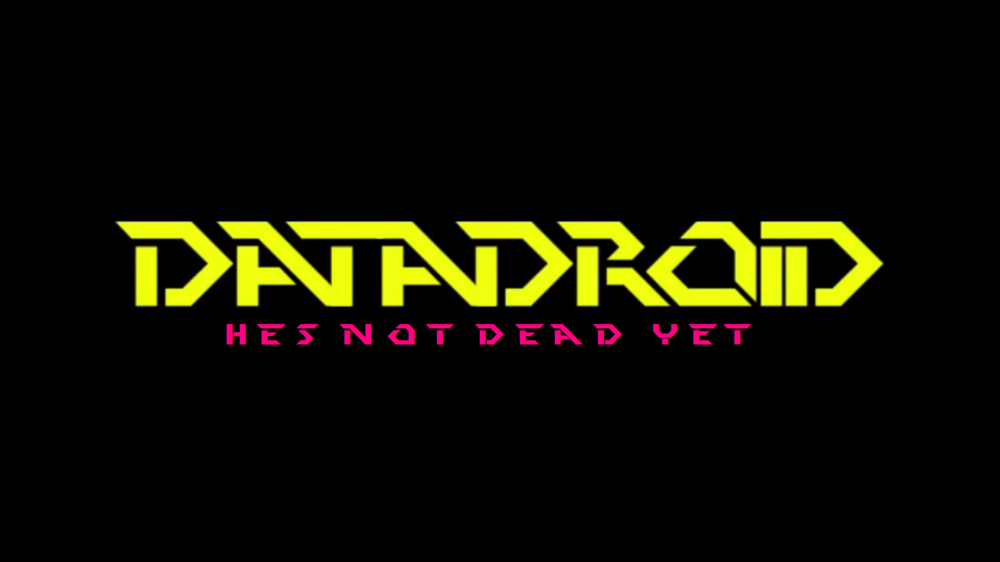

### Tags:
`2D` | `Top-down` | `PixelArt` | `RogueLike` | `Survival`

### Requisitos:
- **Público alvo**: 13 a 15 anos
- **Hardware**: 4GB RAM, 350MB Armazenamento
- **Condição física**: O jogo precisará usar as mãos..

### Plataformas:
- PC (Windows)

### Definições gerais:
- O jogo é um top down 2d onde vc tem q proteger seu amigo robo datadroid.

### Regras do jogo:
- Temos que manter o Datadroid vivo é energizado.

### Elementos:
- Exploração de Areas.

### Mecânicas:
- Sistema de sobrevivencia
- Tiro
- Dash 2D roguelike

### Arte:
- PixelArt

### Conclusão do projeto - Deadline:
- 7 Meses

### Ambientação:
- Um mundo pós-apocalíptico cyberpunk,onde existe muitos poucos humanos
qual o objetivo que deseja alcançar com esse jogo? Lançar meu 1 jogo, e que ele seja conhecido..

### Historia:
- ### Resumo:
- - *Um robo chamado datadroid acaba parando na porta de um humano para fugir da guerra que estava havendo.*

- ### Introdução: 
- - *Um explorador encontra um robô avançado com consciência danificado em sua porta, o robo estava sendo perseguido pois estava aconteçendo uma guerra entre cyborgs e androids, este robo não pertência a nenhuma desses clã, porem ele era o unico diferente ali, ele pede pra que vc ajude-o a sobreviver é escapar, assim vc terá que lutar e defender o robo datadroid.*

- ### Final:
- - *Você está GRAVEMENTE ferido enquanto vários Androids/Cyborgs formaram uma aliança para matá-lo, voce corre e encontra uma cápsula, a cápsula se abre e sai um corpo de um humano se decompondo mais, ainda vivo, ao escutar a voz do homem o HD antigo de datadroid começa a soltar um holograma das lembranças desse humano, logo voce percebe um buraco embaixo da cápsula e aproveita e entra, lá em baixo voce percebe que nao e uma caverna e sim um grande avião de guerra, voce consegue pilota-lo, cyborgs e androids jogam várias bombas em cima de voces, porém os cyborgs evoluíram tanto que podem voar, eles subiram no avião e começaram a destruir, porém datadroid pula do avião e tira eles de lá logo ele fala pro player ativar a Bomba: Sim() Ou Não() caso escolha Sim, você mata todos os cyborgs/androids junto com datadroid, a nave desce e você vê datadroid totalmente destruído,ele fala que não existe mais nenhum humano no mundo exceto você pois todos morreram,assim datadroid “morre” logo aparece um PENDRIVE portando a consciência de datadroid quando era um humano,o player passa a vida inteira sozinho tentando consertar datadroid, até o fim…. caso escolha Não os cyborgs/androids destroçam datadroid e o avião logo aparece um grupo de 6 humanos com armas muito poderosas assim, destruindo todos ali, você sai do avião tendo a perna esmagada, eles te ajudam e te implantam perna/braço mecânicos, logo você vê que datadroid está totalmente destruído você começa a chorar aos pés dele, assim você deixa-o lá e vai embora seguindo sua jornada sozinho, pois você não acha justo ter uma vida feliz enquanto datadroid não, se passa 62 anos você está à beira da morte, a população humana está voltando aos poucos você tem uma morte lenta,triste e sozinho…*

- ### Conclusão:
- - No Final do jogo o protagonista conhece novos humanos é os outros cyborgs é androids morreram, assim a era dos humanos voltaria de pouco em pouco..

### Referencias:
- Cyberwar(Referencia da historia e estilo de mundo..)
Anno Mutationem(Modo de Combate,Estilo do mundo..)

### Semelhantes/concorrência:
- Cyberwar,Anno Mutationem..

### Proposta para o mercado de jogos:
- Criar um jogo de sobrevivência diferente de tudo..
A historia é o sistema de sobrevivencia, no caso que não é vc q tem que sobreviver é sim o data droid

### Proposta de valor:
- Inicialmente o jogo seria grátis porém, isso pode mudar..

### Como se joga:
- A dificuldade do jogo é mediana... a gameplay agente tem que sair de casa para coletar recursos como (HD,baterias etc...) para ajudar seu robô sobreviver,porém se os cyborgs ou androids te verem iram em sua direção o matar...

### Regras do jogo
- Desafios:
- - Destruir Cyborgs/Androids para pegar suas peças(HD, Membros Mecanicos, Armas,etc..)e assim colocar no “Datadroid”, fazendo upgrades nele..

### Evolução:
- O jogador inicia um cara fraco é lerdo, porém ele irá se tornar uma “máquina de guerra”, achando armas em locais do mapa como: Casas Abandonadas,galpões etc..

---
## Elementos
##### Entidades:Cyborgs,Androids é bem poucos humanos..
##### Itens:HD,Bateria,Carregador,Membros Robóticos,Armas,Motores

##### O jogador:
O Jogador é um Homem de 24 anos de idade que tentava sobreviver na Horn City Uma cidade isolada onde não havia ninguém lá tirando ele..

##### encontros/relacionamentos:
O Jogador(No início) Tem muito medo dos Cyborgs/Androids(Pela sua bizarra aparencia) porem, ao longo do jogo este medo vai passando e ele começa a enfrentar eles

## História
Um homem explorador encontra um robô com consciência todo destruído mais ligado em sua porta, o robô estava sendo caçado pois estava acontecendo uma guerra entre cyborgs e androids, este robô não pertencia a nenhuma desses clã, porém ele era o único diferente ali, ele pede pra que vc ajude-o a sobreviver e escapar, assim vc terá que lutar e defender o robô datadroid)

##### Historia de fundo:
Uma guerra que aconteceu há 2000 anos atrás, uma guerra dos próprios humanos contra eles mesmos, usaram bombas Radioativas, e assim a radiação foi matando ao poucos os humanos foram morrendo, para sobreviver alguns humanos substituíram a maioria da suas partes por partes mecânicas se tornando cyborgs, alguns 2- anos depois os cyborgs criaram os androids como uma forma de vida eterna..

##### Momento atual no jogo:
O jogador se Encontra no ano 4054, onde o mundo foi dominado por Androids é cyborgs, ele está na “Cidade Morta” um local que no passado, antes de toda essa destruição, os humanos viviam ele está vagando por aí tentando sobreviver, e a todo momento se pergunta “porque ele é o único vivo?”..

##### Situação no(s) final(is) do jogo:
No Final do jogo, o player está GRAVEMENTE ferido, tendo seu braço arrancado por um android, datadroid mesmo com suas armas não foi páreo, pois os androids/cyborgs fizeram uma aliança para assim dar fim no datadroid, pois a consciência que estava no robô era de um humano antes da guerra, o jogador/datadroid conseguem derrotar um android e assim pegando sua bota foguete o player foge para longe, enquanto os cyborgs/androids estão atrás deles,até que o player acha uma floresta e lá dentro da floresta ele encontra uma cápsula tendo metade dela coberta por terra, quando datadroid encosta na cápsula ela se abre, e dela sai um corpo humano totalmente podre, o player sentiu o mal cheiro, logo aquele "cadáver' começa a se mexer ele    mal consegue falar, então resolve dar play na mensagem gravada, que ele gravou: “Eu criei algo perfeito, eu criei um robô com emoções, sentimentos e pode sentir como nós humanos,eu criei ele para ver se eu consigo parar a guerra que está acontecendo, todos os países criaram um clã, o  clã da “Torre Beta” e o clã da “Cidade Morta” Eles estão criando bombas Nucleares, isso ira matar todos os humanos, mais talvez se eu conseguir colocar minha consciencia neste robo, talvez eu possa…Não isso e ridiculo, ah eu preciso pensar…Desligando” logo o HD velho que o datadroid estava no começo do jogo começa a soltar outra gravação: “Eu estou sendo levado, o clã da “Cidade Morta’ querem que tiro suas partes humanas trocando por partes mecanicas, Isso e ridiculo, eles pegaram todas as minhas gravações não sei se eu vou conseguir fazer isso mais *Soco do Cyborg*... desligando….” o player fica totalmente assustado e não entende nada, você começa a perguntar freneticamente ao "cadáver" porque você é o único vivo?, ele não pode te responder então vc começa a atacá lo freneticamente, até que datadroid te segura os cyborgs começam a te perseguir datadroid percebe que tem uma passagem embaixo da cápsula, vcs decidem descer logo vc ve uma gigante bomba Nuclear que estava aí durante anos, também tinha armas, aviões,helicópteros etc…, você percebe que isso não era um buraco, e sim um gigante avião de guerra logo você tenta pilota-lo vc consegue pois pareçe que esse avião nunca foi usado, assim vcs voam em cima dos cyborgs e jogam a bomba em cima deles, porém os cyborgs evoluíram tanto que podem voar, eles subiram no avião e começaram a destruir, porém datadroid pula do avião e tira eles de lá logo ele fala pro player ativar a Bomba: Sim() Ou Não() caso escolha Sim, você mata todos os cyborgs/androids junto com datadroid, a nave desce e você vê datadroid totalmente destruído,ele fala que não existe mais nenhum humano no mundo exceto você pois todos morreram,assim datadroid “morre” logo aparece um PENDRIVE portando a consciência de datadroid quando era um humano,o player passa a vida inteira sozinho tentando consertar datadroid, até o fim…. caso escolha Não os cyborgs/androids destroçam datadroid e o avião logo aparece um grupo de 6 humanos com armas muito poderosas assim, destruindo todos ali, você sai do avião tendo a perna esmagada, eles te ajudam e te implantam perna/braço mecânicos, logo você vê que datadroid está totalmente destruído você começa a chorar aos pés dele, assim você deixa-o lá e vai embora seguindo sua jornada sozinho, pois você não acha justo ter uma vida feliz enquanto datadroid não, se passa 62 anos você está à beira da morte, a população humana está voltando aos poucos você tem uma morte lenta,triste e sozinho…
## Mecânicas

Quest(Missões): O sistema de missões será dado pelo datadroid, ele irá “dizer” o'que precisa fazer para conseguir consertar ele. 

Exemplo:

Missões Principais:
Destruir 7 Androids e conseguir Botas de Impulso.
Achar 15 Baterias e 1 Carregador.
Trocar o HD de Datadroid.

Missões Secundárias:
Matar 350 Inimigos.
Matar 50 cyborgs.
Achar e explorar um prédio abandonado.
Lutar com Vários Inimigos(40+) sem morrer.

##### Controles
| Função| tecla |
| ---- | ----- |
| mover para cima | W |
| mover para baixo | S |
| mover para esquerda| A |
| mover para direita| D |
| Atirar| Botão Esquerdo do Mouse |
| Abrir o Menu de Pause | ESC |
| Dash | Q |
| Inventário | E |

##### Inteligencia artificial:
O jogo terá vários tipos de inimigos:

Fasty V1:

Ele é um dos Androids “Especiais”, ele tem uma “botas”com propulsores
que lhe permitem dar impulso..

Hp: 450/1000
Damage: 210
Velocity: Nível 3(Velocidade 3x acima do player/datadroid) de 5
Locais de Spawn: Ele pode apareçer na “Dead City” ou na “Beta Tower”..

Brows:

Ele é um android criado para participar de guerras, ele é lento porém, muito resistente ele tem um material chamado “vibrex” um material que pode aprimorar armas.

 Hp: 800 de 1000
 Velocity nível 0,5 de 5,0( 1,5x mais lento que o player)
 Locais onde aparece:
 Torre beta,Cidade morta(Quando se destrói cabanas de Cyborgs)

##### Interações do jogador:
O jogador pode interagir com: Portas,Npcs,Animais,Armas,Cadeira/Bancos, Estabelecimentos

##### eventos automatizados estáticos
- ciclo dia e noite
- clima

## Arte
Pixelart

##### Temática:
pós-apocalíptico é Cyberpunk
##### Estilos:
- Cyberpunk: _"Combina com a ideia geral do jogo"_
- pixel art: _"Escolhido por ser usado na maioria dos jogos 2d"_
- instrumental: _"Retrata bem o Ambiente/Temática Do jogo"_

## Conclusão do projeto
##### Créditos:
Programação: Davitoodygamer /Garbage Monkey
Pixel Art: HeCs / Nokin/ FogoAzul
Músicas: Trigw
Concept Art: FogoAzul / Nokin
